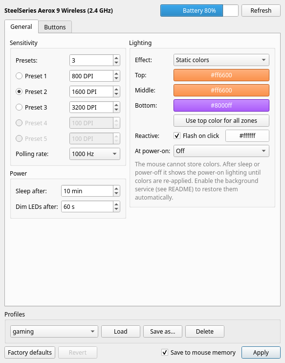
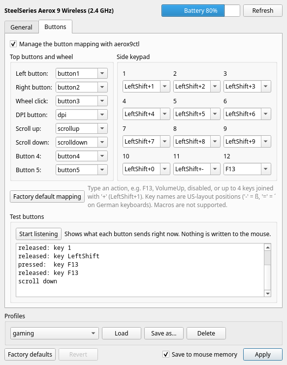
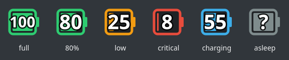

# aerox9ctl — SteelSeries Aerox 9 Wireless on Linux

Configure the **SteelSeries Aerox 9 Wireless** on Linux without SteelSeries GG: DPI,
polling rate, lighting, power timers and **all 20 buttons, including the 12-button side
keypad**. It comes with a command line tool, a Qt desktop app and a system tray battery
indicator.

It's built for immutable distros like **Bazzite** and works the same on the host or
inside a **distrobox** container. It needs no root and no kernel module.

<p align="center">
  
  &nbsp;
  
</p>
<p align="center">
  
</p>

> **Unofficial.** This project isn't affiliated with or endorsed by SteelSeries. The
> device protocol comes from the reverse engineering done by
> [rivalcfg](https://github.com/flozz/rivalcfg) and its contributors.

## Contents

- [Features](#features)
- [What has been confirmed on hardware](#what-has-been-confirmed-on-hardware)
- [Installation](#installation)
- [Usage](#usage): [desktop app](#desktop-app), [tray icon](#tray-icon), [command line](#command-line), [buttons](#button-mapping), [profiles](#profiles)
- [Why lighting needs a background service](#why-lighting-needs-a-background-service)
- [How it works](#how-it-works)
- [Troubleshooting](#troubleshooting)
- [Development](#development)
- [Credits](#credits) · [License](#license)

## Features

| Setting | Range / options | Stored on the mouse |
| --- | --- | :---: |
| DPI presets + active preset | 1–5 presets, 100–18 000 DPI in steps of 100 | ✅ |
| Polling rate | 125 / 250 / 500 / 1000 Hz | ✅ |
| Sleep timer, LED dim timer | 0–20 min, 0–1200 s (0 = never) | ✅ |
| Power-on lighting | off, reactive, rainbow, reactive-rainbow | ✅ |
| Button mapping (20 buttons) | mouse buttons, DPI cycle, scroll, disabled, media keys, up to 4 keys together (`LeftShift+1`, `ctrl+c`) | ✅ |
| Lighting: 3 zones (top / middle / bottom) | static colors or rainbow | ❌ *(re-applied by the [daemon](#why-lighting-needs-a-background-service))* |
| Reactive lighting | flash color on click | ❌ *(same)* |
| Battery | level + charging state, tray icon, low-battery warnings | – |
| Button tester | shows what each button sends (read-only) | – |
| Profiles | named TOML files, switchable from app, tray or CLI | – |

Supported connections: **2.4 GHz dongle** and **USB cable**, including the **WOW
Edition** (USB IDs `1038:1858`, `185a`, `1874`, `1876`). Bluetooth isn't supported.
Macros and smart illumination aren't supported either.

## What has been confirmed on hardware

The mouse can't report its settings back, so features can only be confirmed by
watching the mouse. Every command is checked byte by byte in the test suite against
a simulated device. On a real Aerox 9 (2.4 GHz dongle) so far:

| Feature | Status |
| --- | --- |
| Device detection, battery reading (host and distrobox) | ✅ confirmed |
| Button mapping incl. key combinations (`LeftShift+1` …) | ✅ confirmed with the button tester |
| Button tester, tray icon | ✅ confirmed |
| Saving the button mapping to onboard memory | ⚠️ not confirmed yet |
| DPI / active preset, polling rate, lighting, timers | ⚠️ protocol from rivalcfg, not confirmed with this tool yet |
| Daemon wake detection (does the battery query return nothing while asleep?) | ⚠️ not confirmed yet |
| USB cable mode | ⚠️ not tested |

If you test one of the ⚠️ items, please open an issue with the result.

## Installation

You need Python ≥ 3.11 with `venv`, plus a desktop session for the app and tray icon.
The same script works on the host and inside a distrobox/toolbx container:

```sh
git clone https://github.com/justfaked/steelseries-mouse-util.git
cd steelseries-mouse-util
./install.sh                  # CLI, desktop app, app-menu entry
./install.sh --tray           # + battery tray icon at login
./install.sh --daemon         # + background service that keeps your colors applied
./install.sh --editable       # run straight from this checkout (for development)
./install.sh --uninstall      # remove everything (profiles in ~/.config are kept)
```

What it does:

- Creates a virtualenv in `~/.local/share/aerox9ctl/` (one per container, because
  Python versions can differ between host and containers).
- Puts the launchers `aerox9ctl`, `aerox9ctl-gui` and `aerox9ctl-tray` in `~/.local/bin`.
- Adds an **Aerox 9 Wireless** entry to the app menu.
- **Inside distrobox**, the launchers run the tool through `distrobox-enter`, so the
  command, the menu entry, the tray autostart and the systemd service also work from
  the host.

### Permissions

aerox9ctl talks to `/dev/hidraw*` directly, so it needs no root and never detaches the
kernel driver. Many desktops (including Bazzite) already give the logged-in user
access. If `aerox9ctl status` reports an error opening the mouse, install the
included udev rule **on the host** and re-plug the dongle:

```sh
sudo cp packaging/70-aerox9ctl.rules /etc/udev/rules.d/
sudo udevadm control --reload && sudo udevadm trigger
```

(`/etc` is writable on Bazzite and other atomic Fedora systems.)

## Usage

### Desktop app

Open **Aerox 9 Wireless** from the app menu, or run `aerox9ctl gui`.

- **General:** DPI presets (the radio button marks the active one), polling rate,
  lighting and power timers.
- **Buttons:** one field per button, with the side keypad laid out like the mouse.
  Type an action or pick one from the list. **Test buttons** shows live what each
  button sends.
- **Profiles:** save the form as a named profile, load it later.
- **Apply** sends only what changed. With *Save to mouse memory* checked, persistent
  settings survive a power cycle.

A `*` in the window title means there are changes that haven't been applied yet.

### Tray icon

`aerox9ctl tray` (or `./install.sh --tray` to start it at login) shows the charge level
in the system tray. The icon is green normally, amber below 30%, red below 15%, blue
while charging, and grey `?` when the mouse is asleep or off.

- **Hover:** level and charging state.
- **Left-click:** open the settings.
- **Right-click:** apply a profile, refresh, quit.

It checks the battery once a minute and warns at 20% and 10%. On GNOME it needs the
AppIndicator extension (Bazzite ships it).

### Command line

```sh
aerox9ctl status                        # device, battery, last applied settings
aerox9ctl battery                       # e.g. "80% (discharging)"

aerox9ctl set --dpi 800,1600,3200 --dpi-active 2
aerox9ctl set --polling-rate 1000
aerox9ctl set --color "#ff6600"         # all zones (implies --lighting static)
aerox9ctl set --top-color red --bottom-color purple
aerox9ctl set --lighting rainbow
aerox9ctl set --reactive-color white    # flash on click ('off' to disable)
aerox9ctl set --startup-lighting off    # what the mouse shows at power-on
aerox9ctl set --sleep-timer 10 --dim-timer 60
aerox9ctl set ... --no-save             # apply without writing to onboard memory

aerox9ctl reset                         # factory defaults (not the button mapping)
aerox9ctl --help                        # everything else
```

`set` only sends the settings you name. The mouse can't report its settings back,
so aerox9ctl keeps track of what it last applied in `~/.config/aerox9ctl/current.toml`.

### Button mapping

```sh
aerox9ctl buttons test                  # press buttons, see what they send (read-only)
aerox9ctl buttons show                  # mapping last applied by aerox9ctl
aerox9ctl buttons actions               # every valid action name
aerox9ctl buttons set side1=F13 side2=volup button4=disabled
aerox9ctl buttons set side3=shift+3 side4=ctrl+c
aerox9ctl buttons set side2=default     # restore one button
aerox9ctl buttons reset                 # factory mapping: side keys 1-9, 0, -, =
```

**Buttons:** `button1` (left), `button2` (right), `button3` (wheel click),
`button4`, `button5`, `dpi_button`, `side1`–`side12` (the numbers on the side keypad),
`scrollup`, `scrolldown`.

**Actions:** `button1`–`button5`, `dpi`, `scrollup`, `scrolldown`, `disabled`, media
keys (`VolumeUp`, `VolumeDown`, `Mute`, `PlayPause`, `Next`, `Previous`), or 1–4
keyboard keys joined with `+` (`F13`, `LeftShift+1`, `ctrl+c`, `alt+tab`).

Things to know:

- **Your existing mapping is left alone** until you set one. The mouse can't report
  its mapping, so aerox9ctl never sends button data on its own. A layout made in GG
  keeps working until you set one here.
- **All 20 buttons are written together.** That's how the protocol works. Buttons you
  didn't specify get their factory default. Check your current layout with
  `aerox9ctl buttons test` first and recreate it, e.g.
  `aerox9ctl buttons set side1=shift+1 side2=shift+2 …`. After that, single-button
  changes keep the rest.
- **Key names are US-layout key positions** (HID usages), whatever your desktop
  layout is. On a German layout `-` is ß, `=` is ´, `[` is Ü, `;` is Ö, `'` is Ä, and
  `Y`/`Z` are swapped. So `LeftShift+-` types `?`.
- Try changes with `--no-save` first. A power cycle should bring back the mapping
  saved on the mouse.

### Profiles

Profiles are TOML files in `~/.config/aerox9ctl/profiles/`. Any key you leave out
uses its factory default, and leaving out `[buttons]` keeps the mouse's mapping.

```toml
dpi_presets = [800, 1600, 3200]
dpi_active = 2                 # 1-based
polling_rate = 1000
lighting = "static"            # "static" or "rainbow"
top_color = "#ff6600"          # #rrggbb, #rgb or a name (red, lime, blue, aqua, …)
middle_color = "#ff6600"
bottom_color = "#8000ff"
reactive_color = "off"         # a color, or "off"
startup_lighting = "off"       # off | reactive | rainbow | reactive-rainbow
sleep_timer = 10               # minutes, 0 = never
dim_timer = 60                 # seconds, 0 = never

[buttons]
side1 = "LeftShift+1"
side12 = "F13"
button4 = "disabled"
```

```sh
aerox9ctl profile save gaming           # current configuration → profile
aerox9ctl profile list
aerox9ctl profile show gaming
aerox9ctl apply gaming                  # or: aerox9ctl apply ./some/file.toml
aerox9ctl profile delete gaming
```

## Why lighting needs a background service

The Aerox 9 **can't store colors** in its onboard memory. When it powers on,
reconnects, and probably when it wakes from sleep, it shows its *power-on
lighting* (off or rainbow). On Windows, GG quietly re-applies your colors in the
background.

`aerox9ctl daemon` does the same: it checks the mouse every 5 seconds and re-applies
the lighting from the last applied configuration when the mouse comes (back) online.
It never writes to onboard memory.

```sh
./install.sh --daemon                                   # or later, on the host:
systemctl --user enable --now aerox9ctl-daemon.service
journalctl --user -u aerox9ctl-daemon -f                # watch what it does
```

DPI, polling rate, timers, power-on lighting and the button mapping are stored on the
mouse and don't need the daemon.

## How it works

```
 CLI / Qt app / tray / daemon
            │
     aerox9ctl.device ── settings → command plan, lock, hidraw backend
            │
   rivalcfg (protocol)  +  aerox9ctl.buttons (button packets)
            │
     /dev/hidrawN (interface 3, vendor page 0xFFC0)
            │
   2.4 GHz dongle ─────────► Aerox 9 Wireless
```

- **Protocol:** [rivalcfg](https://github.com/flozz/rivalcfg) 4.17 provides the Aerox 9
  commands (DPI, polling rate, lighting, timers, battery, save). Commands go out as HID
  output reports on interface 3. In 2.4 GHz mode the command byte has the wireless flag
  `0x40` set and the mouse acknowledges each command.
- **Buttons:** rivalcfg doesn't support remapping this mouse yet. aerox9ctl sends the
  mapping as three `0x2A` packets of 5-byte fields, following the unmerged rivalcfg PR
  [#243](https://github.com/flozz/rivalcfg/pull/243). Keyboard fields hold up to 4 HID
  key codes (`51 E1 1E 00 00` = LeftShift+1), following the maintainer's captures in
  [#171](https://github.com/flozz/rivalcfg/issues/171).
- **Button tester:** reads the mouse's standard input interfaces (mouse, keyboard,
  boot keyboard, consumer control) and decodes the reports. It never writes.
- **hidraw backend:** the `hidapi` package uses libusb by default, which detaches the
  kernel driver. aerox9ctl switches rivalcfg to hidapi's hidraw backend, so only
  `/dev/hidraw*` access is needed. That's also why it works unchanged in containers.
  Set `AEROX9CTL_HID_BACKEND=libusb` to switch back.
- **Locking:** the app, tray, CLI and daemon share a lock in `$XDG_RUNTIME_DIR` (shared
  between host and distrobox), so their commands never interleave.

## Troubleshooting

| Problem | What to do |
| --- | --- |
| `no SteelSeries Aerox 9 Wireless found` | Check the dongle/cable. Bluetooth mode isn't supported. |
| `cannot talk to the mouse: open failed` | Install the [udev rule](#permissions) on the host and re-plug the dongle. |
| Battery shows "unavailable" | The mouse is asleep or switched off. Move it. |
| Colors reset after sleep or power-off | Expected. Enable the [daemon](#why-lighting-needs-a-background-service). |
| Side buttons type the wrong characters | Key names are US positions: see [button mapping](#button-mapping). |
| App shows factory defaults, not your settings | The mouse can't report its settings. Apply once and aerox9ctl remembers. |
| Tray icon missing | Check the hidden-icons area of the panel. On GNOME, enable the AppIndicator extension. |
| "Could not register app ID" warning | Harmless. It goes away once `install.sh` has created the menu entry. |

## Development

```sh
python3 -m venv .venv
.venv/bin/pip install -e ".[gui,dev]"
.venv/bin/pytest
```

The tests run against rivalcfg's simulated device (`RIVALCFG_DRY=1`) and check the
exact bytes that would be sent. They never touch a real mouse, and GUI/tray tests run
with `QT_QPA_PLATFORM=offscreen`. To try the app without sending anything:

```sh
RIVALCFG_DRY=1 RIVALCFG_PROFILE=1038:1858 .venv/bin/aerox9ctl gui
```

| Module | Purpose |
| --- | --- |
| `config.py` | settings model, validation, TOML profiles and state |
| `device.py` | rivalcfg access, hidraw backend, locking, settings → command plan |
| `buttons.py` | button mapping encoding (20 × 5-byte fields, 3 packets) |
| `tester.py` | read-only decoding of the mouse's input reports |
| `cli.py` | command line interface |
| `gui.py` | Qt settings window |
| `tray.py` | system tray battery indicator |
| `daemon.py` | re-applies lighting when the mouse comes online |

## Credits

- [rivalcfg](https://github.com/flozz/rivalcfg) by Fabien Loison (flozz) and
  contributors: the device protocol, key code tables, and the Aerox 9 button work in
  PR #243 by zebreus.
- [cython-hidapi](https://github.com/trezor/cython-hidapi) and
  [PySide6](https://doc.qt.io/qtforpython-6/).

## License

[MIT](LICENSE) © 2026 Philipp Kilb. Dependencies keep their own licenses: rivalcfg
(WTFPL), hidapi (BSD / GPL-3.0 / original hidapi license), PySide6 (LGPL-3.0).

"SteelSeries" and "Aerox" are trademarks of SteelSeries ApS, used here only to
name the hardware this tool works with.
